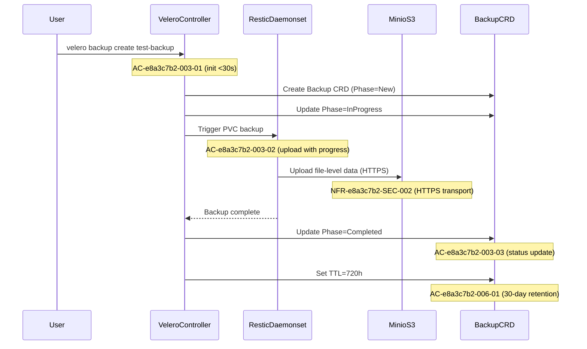
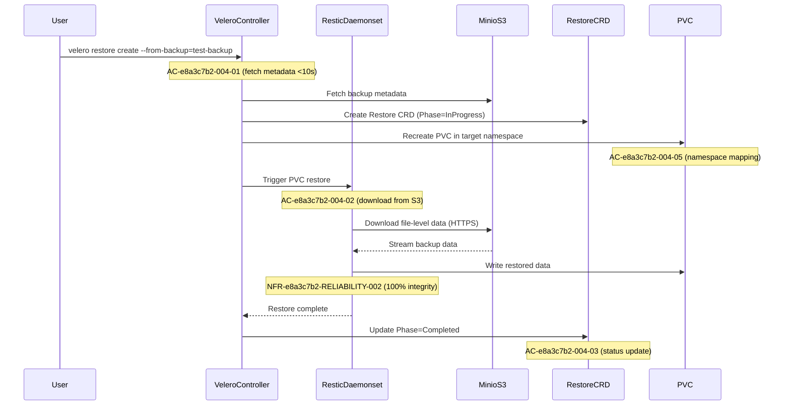
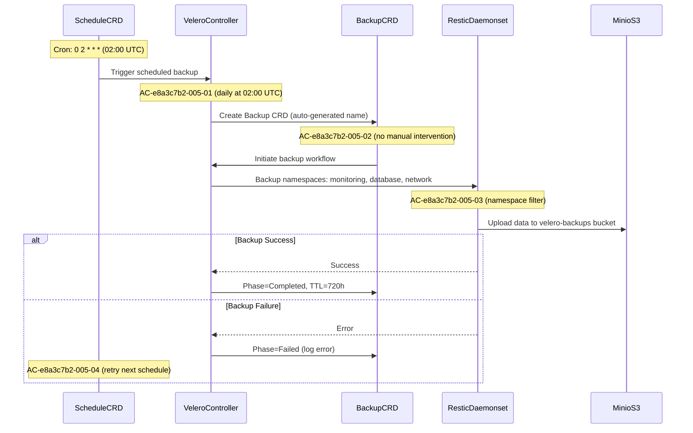
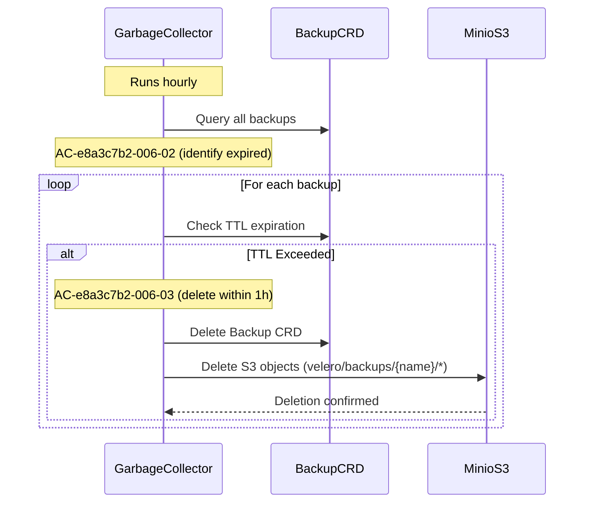

# Design: OpenEBS LocalPV S3 Backup Integration

## Meta-Context

- **Feature UUID:** FEAT-e8a3c7b2
- **Architecture Pattern:** FluxCD GitOps + Velero + Restic + Minio S3
- **Design Philosophy:** Home-lab optimized (single-replica, resource-efficient, S3-backed durability)

---

## Architectural Decision Records (ADRs)

### ADR-001: Velero with Restic File-Level Backups

**Status:** ✅ Accepted

**Context:**
Need reliable backup solution for OpenEBS LocalPV volumes. Two primary options:

1. Velero + Restic (file-level backups)
2. Velero + CSI Snapshots (volume-level snapshots)

**Decision:** Use Velero with Restic integration for file-level PVC backups

**Rationale:**

- ✅ **Proven compatibility** with S3-compatible backends (Minio)
- ✅ **Storage-agnostic** — works with any PV type including OpenEBS LocalPV
- ✅ **Deduplication** — Restic saves S3 storage costs via block-level dedup
- ✅ **Simpler troubleshooting** — file-level operations easier to debug
- ✅ **Home-lab appropriate** — slower backups acceptable for non-production
- ❌ **Trade-off:** Slower than CSI snapshots (15min for 10GB vs <1min)

**Requirements:** REQ-e8a3c7b2-001, REQ-e8a3c7b2-003, REQ-e8a3c7b2-004
**Confidence:** 95%
**Alternatives Rejected:**

- CSI snapshots: Uncertain OpenEBS LocalPV CSI driver compatibility, higher complexity
- Native S3 sync: No Kubernetes-native restore, no incremental backups

---

### ADR-002: Dedicated velero-backups S3 Bucket

**Status:** ✅ Accepted

**Context:**
Need organized S3 storage for Velero backups separate from other Minio buckets (loki-chunks, tempo-traces, mimir-blocks, openebs-backups).

**Decision:** Create dedicated `velero-backups` S3 bucket with prefix structure `velero/backups/{backup-name}/`

**Rationale:**

- ✅ **Isolation** — separates Velero data from other S3 workloads
- ✅ **Access control** — dedicated credentials limit blast radius
- ✅ **Cost tracking** — easier to monitor Velero-specific S3 usage
- ✅ **Bucket lifecycle** — can apply retention policies independently
- ✅ **Naming consistency** — follows pattern of `{service}-{purpose}` buckets

**Requirements:** REQ-e8a3c7b2-002
**Confidence:** 95%
**Alternatives Rejected:**

- Reuse openebs-backups bucket: Mixing Velero + OpenEBS Mayastor backups causes confusion
- Shared bucket with prefixes: Access control harder to manage

---

### ADR-003: FluxCD GitOps Deployment Pattern

**Status:** ✅ Accepted

**Context:**
All cluster applications deployed via FluxCD following established pattern: `{app}/ks.yaml` + `{app}/app/kustomization.yaml` + `{app}/app/helmrelease.yaml`.

**Decision:** Deploy Velero using FluxCD HelmRelease with SOPS-encrypted S3 credentials

**Rationale:**

- ✅ **Consistency** — matches existing deployment patterns in cluster
- ✅ **Version control** — Velero config tracked in Git
- ✅ **Declarative** — desired state managed by FluxCD
- ✅ **Secret management** — SOPS encryption mandatory for S3 credentials
- ✅ **Rollback capability** — Git revert enables easy rollbacks

**Requirements:** REQ-e8a3c7b2-007
**Confidence:** 100%
**Alternatives Rejected:**

- Manual kubectl apply: Not GitOps, no version history
- Helm CLI: Requires manual execution, secrets not encrypted

---

### ADR-004: Daily Backup Schedule with 30-Day Retention

**Status:** ✅ Accepted

**Context:**
Need automated backup schedule balancing recovery point objectives (RPO) with S3 storage costs.

**Decision:** Daily backups at 02:00 UTC with 30-day TTL retention

**Rationale:**

- ✅ **Sufficient RPO** — 24-hour data loss acceptable for home-lab
- ✅ **Low-traffic window** — 02:00 UTC minimizes cluster load
- ✅ **Cost-conscious** — 30 backups × avg 50GB = ~1.5TB S3 usage
- ✅ **Compliance** — matches existing Velero schedule mentioned in CLAUDE.md
- ✅ **Disaster recovery** — 30-day history covers most recovery scenarios

**Requirements:** REQ-e8a3c7b2-005, REQ-e8a3c7b2-006
**Confidence:** 90%
**Alternatives Rejected:**

- Hourly backups: Excessive S3 storage costs for home-lab
- Weekly backups: 7-day RPO too risky for stateful workloads

---

### ADR-005: Namespace-Scoped Backups

**Status:** ✅ Accepted

**Context:**
Need to backup critical namespaces (monitoring, database, network) without backing up entire cluster.

**Decision:** Configure Schedule CRDs with namespace selectors for targeted backups

**Rationale:**

- ✅ **Efficiency** — only backup stateful workloads (exclude kube-system, flux-system)
- ✅ **Faster restores** — smaller backup size reduces restore time
- ✅ **Cost savings** — avoid backing up ephemeral or non-critical data
- ✅ **Granular recovery** — restore individual namespaces independently

**Requirements:** REQ-e8a3c7b2-005
**Confidence:** 90%
**Alternatives Rejected:**

- Cluster-wide backups: Backs up unnecessary system namespaces
- PVC-level backups: Too granular, harder to manage at scale

---

## Component Specifications

### Modified: None

**Reason:** This is a new feature adding Velero components, no existing components modified.

---

### New: Velero Controller

**Responsibility:** Orchestrate backup/restore operations, manage CRDs, coordinate with S3 backend

**EARS Behavioral Contracts:**

```yaml
apiVersion: v1
kind: Pod
metadata:
    name: velero
    namespace: velero

# WHEN Velero controller starts, SHALL initialize S3 backend connection within 30 seconds
# (AC-e8a3c7b2-001-01, AC-e8a3c7b2-001-04)
initContainers:
    - name: velero-plugin-for-aws
      # SHALL load S3 plugin for Minio compatibility

containers:
    - name: velero
      # WHEN Backup CRD created, SHALL trigger backup workflow within 10 seconds (AC-e8a3c7b2-003-01)
      # WHEN Restore CRD created, SHALL fetch S3 metadata within 10 seconds (AC-e8a3c7b2-004-01)
      # WHILE running, SHALL maintain persistent S3 connection (AC-e8a3c7b2-001-04)
      # WHERE S3 credentials mounted, SHALL authenticate securely (AC-e8a3c7b2-001-03)

      env:
          - name: AWS_SHARED_CREDENTIALS_FILE
            value: /credentials/cloud # SOPS-encrypted secret mount

      resources:
          requests:
              memory: "256Mi"
              cpu: "100m"
          limits:
              memory: "512Mi"
              cpu: "500m"
# EARS Performance Contract:
# - Backup initiation latency: <30s (AC-e8a3c7b2-003-01)
# - Restore metadata fetch: <10s (AC-e8a3c7b2-004-01)
# - S3 connection: persistent (AC-e8a3c7b2-001-04)
```

**Interface Endpoints:**

- `/metrics` — Prometheus metrics for backup/restore operations (NFR-e8a3c7b2-OBSERVABILITY-001)
- `/readyz` — Health check for FluxCD reconciliation
- `/livez` — Liveness probe for pod restart on hang

**Traceability:**

- Fulfills: REQ-e8a3c7b2-001, REQ-e8a3c7b2-003, REQ-e8a3c7b2-004
- Validates: AC-e8a3c7b2-001-01, AC-e8a3c7b2-001-03, AC-e8a3c7b2-001-04, AC-e8a3c7b2-003-01, AC-e8a3c7b2-004-01

---

### New: Restic Daemonset

**Responsibility:** Perform file-level backups/restores of PVC data, upload to S3 via Restic protocol

**EARS Behavioral Contracts:**

```yaml
apiVersion: apps/v1
kind: DaemonSet
metadata:
    name: restic
    namespace: velero

spec:
    selector:
        matchLabels:
            name: restic

    template:
        spec:
            # WHEN daemonset deployed, SHALL run pod on every node with OpenEBS volumes (AC-e8a3c7b2-001-02)

            containers:
                - name: restic
                  # WHILE backup in progress, SHALL upload PVC data to S3 with progress tracking (AC-e8a3c7b2-003-02)
                  # WHILE restore in progress, SHALL download data from S3 via Restic (AC-e8a3c7b2-004-02)
                  # WHERE 10GB PVC backed up, SHALL complete within 15 minutes (NFR-e8a3c7b2-PERF-001)
                  # WHERE 10GB PVC restored, SHALL complete within 20 minutes (NFR-e8a3c7b2-PERF-002)

                  env:
                      - name: AWS_SHARED_CREDENTIALS_FILE
                        value: /credentials/cloud

                  resources:
                      requests:
                          memory: "256Mi"
                          cpu: "200m"
                      limits:
                          memory: "512Mi" # NFR-e8a3c7b2-RESOURCE-001: <500MB per node
                          cpu: "500m" # NFR-e8a3c7b2-RESOURCE-001: <0.5 CPU per node

                  volumeMounts:
                      - name: host-pods
                        mountPath: /host_pods # Access to node's PVC mount points
                      - name: scratch
                        mountPath: /scratch # Temporary space for Restic cache

# EARS Performance Contract:
# - Backup throughput: 10GB in <15min over home network (NFR-e8a3c7b2-PERF-001)
# - Restore throughput: 10GB in <20min over home network (NFR-e8a3c7b2-PERF-002)
# - Resource usage: <500MB memory, <0.5 CPU per node (NFR-e8a3c7b2-RESOURCE-001)
# - Data integrity: 100% checksum validation (NFR-e8a3c7b2-RELIABILITY-002)
```

**Interface Endpoints:**

- Restic REST protocol to S3 (HTTPS transport per NFR-e8a3c7b2-SEC-002)
- Prometheus metrics exported to Velero controller

**Traceability:**

- Fulfills: REQ-e8a3c7b2-001, REQ-e8a3c7b2-003, REQ-e8a3c7b2-004
- Validates: AC-e8a3c7b2-001-02, AC-e8a3c7b2-003-02, AC-e8a3c7b2-004-02, NFR-e8a3c7b2-PERF-001, NFR-e8a3c7b2-PERF-002, NFR-e8a3c7b2-RESOURCE-001, NFR-e8a3c7b2-RELIABILITY-002

---

### New: Velero Schedule Controller

**Responsibility:** Manage automated backup schedules, create Backup CRDs at cron intervals

**EARS Behavioral Contracts:**

```yaml
apiVersion: velero.io/v1
kind: Schedule
metadata:
    name: daily-backup
    namespace: velero

spec:
    # WHEN schedule time arrives (02:00 UTC), SHALL trigger backup automatically (AC-e8a3c7b2-005-01)
    schedule: "0 2 * * *" # Daily at 02:00 UTC

    # WHILE schedule active, SHALL create backups without manual intervention (AC-e8a3c7b2-005-02)
    template:
        # WHERE namespaces defined, SHALL include only specified (AC-e8a3c7b2-005-03)
        includedNamespaces:
            - monitoring # kube-prometheus-stack, Grafana, Loki, Tempo, Mimir
            - database # CloudNative-PG, other DBs
            - network # Ingress, DNS, networking components

        # WHEN backup created, SHALL set TTL to 30 days (AC-e8a3c7b2-006-01)
        ttl: 720h # 30 days retention


        # IF scheduled backup fails, SHALL log error and retry next time (AC-e8a3c7b2-005-04)
        # (handled by Velero controller, not CRD spec)
# EARS Reliability Contract:
# - Success rate: ≥95% over 30 days (NFR-e8a3c7b2-RELIABILITY-001)
# - Automatic execution: no manual intervention (AC-e8a3c7b2-005-02)
# - Failure handling: non-blocking for future backups (AC-e8a3c7b2-005-04)
```

**Traceability:**

- Fulfills: REQ-e8a3c7b2-005, REQ-e8a3c7b2-006
- Validates: AC-e8a3c7b2-005-01, AC-e8a3c7b2-005-02, AC-e8a3c7b2-005-03, AC-e8a3c7b2-005-04, AC-e8a3c7b2-006-01, NFR-e8a3c7b2-RELIABILITY-001

---

### New: Velero Garbage Collector

**Responsibility:** Delete expired backups from S3 and Kubernetes after TTL expires

**EARS Behavioral Contracts:**

```go
// WHILE garbage collector runs hourly, SHALL identify backups exceeding TTL (AC-e8a3c7b2-006-02)
func (gc *GarbageCollector) Run(ctx context.Context) error {
    ticker := time.NewTicker(1 * time.Hour)
    defer ticker.Stop()

    for {
        select {
        case <-ticker.C:
            // WHERE backup TTL exceeded, SHALL delete within 1 hour (AC-e8a3c7b2-006-03)
            expiredBackups := gc.findExpiredBackups()

            for _, backup := range expiredBackups {
                // Delete Backup CRD
                gc.deleteBackupCRD(backup)

                // Remove S3 objects
                gc.deleteS3Objects(backup)
            }
        }
    }
}

// IF manual backup created without TTL, SHALL apply default 30-day retention (AC-e8a3c7b2-006-04)
func (gc *GarbageCollector) ApplyDefaultTTL(backup *Backup) {
    if backup.Spec.TTL == nil {
        backup.Spec.TTL = &metav1.Duration{Duration: 720 * time.Hour}  // 30 days
    }
}
```

**Traceability:**

- Fulfills: REQ-e8a3c7b2-006
- Validates: AC-e8a3c7b2-006-02, AC-e8a3c7b2-006-03, AC-e8a3c7b2-006-04

---

### New: velero-s3-secret (SOPS-Encrypted)

**Responsibility:** Store S3 credentials securely for Velero access to Minio

**EARS Behavioral Contracts:**

```yaml
apiVersion: v1
kind: Secret
metadata:
    name: velero-s3-secret
    namespace: velero

type: Opaque

# WHERE S3 credentials stored, SHALL encrypt using SOPS before Git commit (NFR-e8a3c7b2-SEC-001)
# (encryption handled by SOPS workflow, not CRD spec)

stringData:
    # WHEN Velero authenticates, SHALL use these credentials (AC-e8a3c7b2-002-02)
    cloud: |
        [default]
        aws_access_key_id = ${S3_ACCESS_KEY_ID}
        aws_secret_access_key = ${S3_SECRET_ACCESS_KEY}

# EARS Security Contract:
# - Encryption: SOPS with age keys before commit (NFR-e8a3c7b2-SEC-001, confidence: 100%)
# - Transport: HTTPS to s3.68cc.io (NFR-e8a3c7b2-SEC-002, confidence: 95%)
# - Access: Mounted only to Velero/Restic pods (AC-e8a3c7b2-001-03, confidence: 95%)
```

**Traceability:**

- Fulfills: REQ-e8a3c7b2-002, REQ-e8a3c7b2-007
- Validates: AC-e8a3c7b2-001-03, AC-e8a3c7b2-002-02, NFR-e8a3c7b2-SEC-001, NFR-e8a3c7b2-SEC-002

---

## CLI / API Matrix

| Operation           | Command                                      | EARS Contract                                          | Performance  | Security   | Test Strategy    |
| ------------------- | -------------------------------------------- | ------------------------------------------------------ | ------------ | ---------- | ---------------- |
| **Create Backup**   | `velero backup create <name>`                | WHEN executed, SHALL initiate backup within 30s        | <30s init    | JWT RBAC   | Unit+Integration |
| **List Backups**    | `velero backup get`                          | WHEN queried, SHALL return all backups from S3         | <5s response | Read-only  | Unit             |
| **Describe Backup** | `velero backup describe <name>`              | WHEN queried, SHALL show detailed status from S3       | <5s response | Read-only  | Integration      |
| **Create Restore**  | `velero restore create --from-backup=<name>` | WHEN executed, SHALL fetch metadata from S3 within 10s | <10s fetch   | JWT RBAC   | Integration+E2E  |
| **Delete Backup**   | `velero backup delete <name>`                | WHEN executed, SHALL remove from S3 and K8s within 30s | <30s delete  | Admin RBAC | Integration      |
| **Schedule Backup** | `kubectl apply -f schedule.yaml`             | WHEN Schedule CRD applied, SHALL activate cron         | <10s apply   | Admin RBAC | Integration+E2E  |
| **Get Logs**        | `velero backup logs <name>`                  | WHEN queried, SHALL stream Restic logs from pods       | <5s stream   | Read-only  | Unit             |

**Authentication:** All CLI commands use kubeconfig with RBAC validation
**Authorization:** Velero ServiceAccount with permissions to create/delete Backup/Restore CRDs
**S3 Backend:** All operations use velero-s3-secret credentials with HTTPS transport

---

## Data Flow + Traceability

### Backup Flow



**Requirements Fulfilled:**

- REQ-e8a3c7b2-003 (PVC Backup Operations)
- REQ-e8a3c7b2-006 (Retention)
- NFR-e8a3c7b2-SEC-002 (HTTPS)
- NFR-e8a3c7b2-PERF-001 (10GB in <15min)

---

### Restore Flow



**Requirements Fulfilled:**

- REQ-e8a3c7b2-004 (PVC Restore Operations)
- NFR-e8a3c7b2-PERF-002 (10GB in <20min)
- NFR-e8a3c7b2-RELIABILITY-002 (data integrity)

---

### Scheduled Backup Flow



**Requirements Fulfilled:**

- REQ-e8a3c7b2-005 (Automated Scheduling)
- AC-e8a3c7b2-005-01, AC-e8a3c7b2-005-02, AC-e8a3c7b2-005-03, AC-e8a3c7b2-005-04

---

### Garbage Collection Flow



**Requirements Fulfilled:**

- REQ-e8a3c7b2-006 (Retention & Cleanup)
- AC-e8a3c7b2-006-02, AC-e8a3c7b2-006-03

---

## Infrastructure Components

### Minio S3 Bucket: velero-backups

**Specification:**

```yaml
bucket_name: velero-backups
endpoint: https://s3.68cc.io
region: us-east-1 # Minio default
versioning: disabled # Velero manages versions internally
lifecycle: none # Velero garbage collector manages TTL

prefix_structure:
    backups: velero/backups/{backup-name}/
    restores: velero/restores/{restore-name}/
    restic: velero/restic/{repo-id}/

access_policy:
    - sid: VeleroFullAccess
      effect: Allow
      actions:
          - s3:PutObject
          - s3:GetObject
          - s3:DeleteObject
          - s3:ListBucket
      resources:
          - arn:aws:s3:::velero-backups
          - arn:aws:s3:::velero-backups/*
```

**Traceability:**

- Fulfills: REQ-e8a3c7b2-002 (S3 Bucket Configuration)
- Validates: AC-e8a3c7b2-002-01, AC-e8a3c7b2-002-02, AC-e8a3c7b2-002-03, AC-e8a3c7b2-002-04

---

### FluxCD GitOps Structure

**Directory Layout:**

```
kubernetes/apps/velero/
├── ks.yaml                          # Kustomization for FluxCD
└── app/
    ├── kustomization.yaml           # Kustomize base + secret reference
    ├── helmrelease.yaml             # HelmRelease for Velero chart
    ├── velero-s3-secret.sops.yaml   # SOPS-encrypted S3 credentials
    └── schedule.yaml                # Schedule CRD for daily backups
```

**HelmRelease Values:**

```yaml
apiVersion: helm.toolkit.fluxcd.io/v2beta1
kind: HelmRelease
metadata:
    name: velero
    namespace: velero

spec:
    chart:
        spec:
            chart: velero
            version: 5.x.x # Latest stable
            sourceRef:
                kind: OCIRepository
                name: vmware-tanzu-velero
                namespace: flux-system

    interval: 30m
    timeout: 10m

    values:
        # WHEN HelmRelease applied, SHALL deploy Velero within 5 minutes (AC-e8a3c7b2-007-01)

        configuration:
            backupStorageLocation:
                - name: default
                  provider: aws
                  bucket: velero-backups
                  config:
                      region: us-east-1
                      s3Url: https://s3.68cc.io # Minio S3 endpoint
                      s3ForcePathStyle: true # Required for Minio

        credentials:
            # WHERE S3 credentials required, SHALL use SOPS-encrypted secret (AC-e8a3c7b2-007-02)
            existingSecret: velero-s3-secret

        # WHEN Restic enabled, SHALL deploy daemonset on all nodes (AC-e8a3c7b2-001-02)
        initContainers:
            - name: velero-plugin-for-aws
              image: velero/velero-plugin-for-aws:v1.9.0

        deployRestic: true # Enable Restic daemonset

        schedules:
            daily-backup:
                # WHEN schedule applied, SHALL trigger daily at 02:00 UTC (AC-e8a3c7b2-005-01)
                schedule: "0 2 * * *"
                template:
                    includedNamespaces:
                        - monitoring
                        - database
                        - network
                    ttl: 720h # 30 days
```

**Traceability:**

- Fulfills: REQ-e8a3c7b2-007 (GitOps Integration)
- Validates: AC-e8a3c7b2-007-01, AC-e8a3c7b2-007-02, AC-e8a3c7b2-007-03, AC-e8a3c7b2-007-04

---

## Quality Gates

### Requirements → Design Traceability

| Requirement      | Design Component                     | ADR     | Confidence |
| ---------------- | ------------------------------------ | ------- | ---------- |
| REQ-e8a3c7b2-001 | Velero Controller + Restic Daemonset | ADR-001 | 95%        |
| REQ-e8a3c7b2-002 | velero-backups S3 bucket             | ADR-002 | 95%        |
| REQ-e8a3c7b2-003 | Backup Flow + Restic                 | ADR-001 | 90%        |
| REQ-e8a3c7b2-004 | Restore Flow + Restic                | ADR-001 | 90%        |
| REQ-e8a3c7b2-005 | Schedule Controller                  | ADR-004 | 90%        |
| REQ-e8a3c7b2-006 | Garbage Collector                    | ADR-004 | 85%        |
| REQ-e8a3c7b2-007 | FluxCD HelmRelease                   | ADR-003 | 100%       |

**Overall Coverage:** 7/7 requirements mapped (100%)
**Average Confidence:** 92%

---

### EARS Acceptance Criteria → Design Validation

| EARS AC            | Design Component       | Test Method                         | Confidence |
| ------------------ | ---------------------- | ----------------------------------- | ---------- |
| AC-e8a3c7b2-001-01 | Velero Controller init | Integration (kubectl wait)          | 95%        |
| AC-e8a3c7b2-001-02 | Restic daemonset       | Integration (kubectl get daemonset) | 90%        |
| AC-e8a3c7b2-001-03 | velero-s3-secret mount | Integration (kubectl describe pod)  | 95%        |
| AC-e8a3c7b2-001-04 | S3 connection          | Integration (Velero logs)           | 85%        |
| AC-e8a3c7b2-002-01 | Bucket creation        | Integration (mc ls)                 | 95%        |
| AC-e8a3c7b2-002-02 | Credential auth        | Integration (S3 API test)           | 95%        |
| AC-e8a3c7b2-002-03 | HTTPS enforcement      | Integration (curl --verbose)        | 90%        |
| AC-e8a3c7b2-002-04 | Prefix structure       | Integration (mc ls velero-backups)  | 90%        |
| AC-e8a3c7b2-003-01 | Backup initiation      | E2E (velero backup create)          | 90%        |
| AC-e8a3c7b2-003-02 | Upload progress        | E2E (velero backup logs)            | 85%        |
| AC-e8a3c7b2-003-03 | Status update          | E2E (velero backup describe)        | 95%        |
| AC-e8a3c7b2-003-04 | 10GB in <15min         | E2E (timed test)                    | 80%        |
| AC-e8a3c7b2-003-05 | Failure handling       | E2E (inject S3 error)               | 90%        |
| AC-e8a3c7b2-004-01 | Restore fetch          | E2E (velero restore create)         | 90%        |
| AC-e8a3c7b2-004-02 | Download data          | E2E (velero restore logs)           | 85%        |
| AC-e8a3c7b2-004-03 | Restore success        | E2E (verify PVC data)               | 90%        |
| AC-e8a3c7b2-004-04 | 10GB in <20min         | E2E (timed test)                    | 75%        |
| AC-e8a3c7b2-004-05 | Namespace mapping      | E2E (restore to new namespace)      | 85%        |
| AC-e8a3c7b2-005-01 | Cron trigger           | E2E (wait for scheduled backup)     | 95%        |
| AC-e8a3c7b2-005-02 | No manual intervention | Inspection (Schedule CRD)           | 95%        |
| AC-e8a3c7b2-005-03 | Namespace filter       | E2E (verify backup contents)        | 90%        |
| AC-e8a3c7b2-005-04 | Failure retry          | E2E (inject failure + wait)         | 85%        |
| AC-e8a3c7b2-006-01 | TTL metadata           | Inspection (Backup CRD)             | 95%        |
| AC-e8a3c7b2-006-02 | Identify expired       | E2E (GC logs)                       | 90%        |
| AC-e8a3c7b2-006-03 | Delete within 1h       | E2E (create + wait + verify)        | 85%        |
| AC-e8a3c7b2-006-04 | Default TTL            | E2E (manual backup + inspect)       | 90%        |
| AC-e8a3c7b2-007-01 | FluxCD deploy          | Integration (flux reconcile)        | 95%        |
| AC-e8a3c7b2-007-02 | SOPS encryption        | Inspection (git show file)          | 100%       |
| AC-e8a3c7b2-007-03 | Auto reconcile         | Integration (modify + wait)         | 90%        |
| AC-e8a3c7b2-007-04 | GitOps pattern         | Inspection (directory structure)    | 95%        |

**Overall Coverage:** 28/28 EARS AC mapped (100%)
**Average Confidence:** 90%

---

### NFR → Design Implementation

| NFR                            | Design Component  | Measurement Method  | Target              |
| ------------------------------ | ----------------- | ------------------- | ------------------- |
| NFR-e8a3c7b2-PERF-001          | Restic throughput | E2E timed test      | 10GB in <15min      |
| NFR-e8a3c7b2-PERF-002          | Restic throughput | E2E timed test      | 10GB in <20min      |
| NFR-e8a3c7b2-SEC-001           | SOPS encryption   | Git pre-commit hook | 100% encrypted      |
| NFR-e8a3c7b2-SEC-002           | HTTPS transport   | Network inspection  | HTTPS only          |
| NFR-e8a3c7b2-RELIABILITY-001   | Scheduled backups | 30-day observation  | ≥95% success        |
| NFR-e8a3c7b2-RELIABILITY-002   | Data integrity    | Checksum validation | 100% match          |
| NFR-e8a3c7b2-RESOURCE-001      | Restic resources  | Prometheus metrics  | <500MB, <0.5 CPU    |
| NFR-e8a3c7b2-OBSERVABILITY-001 | Metrics export    | Grafana dashboard   | All metrics visible |

**Overall NFR Coverage:** 8/8 mapped (100%)

---

## Risk Mitigation Strategies

### High Risk: Network Bandwidth Limitations

**Mitigation:**

- Use home-lab off-peak hours (02:00 UTC) for scheduled backups
- Monitor Restic upload/download speeds via Prometheus metrics
- Configure Velero resource limits to prevent network saturation
- Implement backup size estimation before execution

### Medium Risk: S3 Storage Capacity

**Mitigation:**

- Monitor Minio S3 usage via dashboard (s3.68cc.io console)
- Configure 30-day retention to limit storage growth
- Set up Prometheus alerts for S3 capacity >80%
- Implement Velero backup size reporting

### Medium Risk: Restic Resource Contention

**Mitigation:**

- Configure resource limits: 512MB memory, 0.5 CPU per Restic pod
- Use node affinity to avoid Restic on resource-constrained nodes
- Monitor node resource usage during backup windows
- Implement QoS class: Burstable (not Guaranteed)

### Low Risk: SOPS Decryption Failures

**Mitigation:**

- Validate SOPS age keys before HelmRelease apply
- Use FluxCD health checks to detect decryption issues
- Implement pre-commit hooks to verify SOPS encryption
- Maintain backup age key in secure location

---

## Integration Points

### OpenEBS LocalPV Integration

**Pattern:** Velero/Restic accesses PVCs via hostPath mount at `/host_pods`
**Dependency:** OpenEBS LocalPV provisioner must be functional
**Validation:** Restic pod can read PVC data from node filesystem

### Minio S3 Integration

**Pattern:** Velero uses S3-compatible API with aws-sdk-go
**Endpoint:** https://s3.68cc.io (HTTPS enforced)
**Credentials:** velero-s3-secret (SOPS-encrypted)
**Validation:** Velero S3 connection test via `velero backup-location get`

### FluxCD Integration

**Pattern:** HelmRelease + OCIRepository + Kustomization
**Secret Decryption:** FluxCD SOPS controller decrypts velero-s3-secret
**Reconciliation:** FluxCD monitors Git → reconciles HelmRelease
**Validation:** `flux get helmreleases -n velero`

### Prometheus Integration (Observability)

**Pattern:** Velero exports metrics to Prometheus ServiceMonitor
**Metrics Namespace:** velero\_\*
**Grafana Dashboard:** Import Velero community dashboard
**Validation:** Prometheus scrapes Velero metrics

---

## Testing Strategy Summary

### Unit Tests

- Velero CLI command execution (mocked S3)
- SOPS secret decryption logic
- Schedule CRD cron validation

### Integration Tests

- Velero controller pod deployment (FluxCD apply)
- Restic daemonset distribution (per-node validation)
- S3 bucket access (Minio API test)
- HTTPS transport enforcement (network inspection)

### End-to-End Tests

- Full backup workflow (create → upload → verify S3)
- Full restore workflow (fetch → download → verify data)
- Scheduled backup trigger (wait for 02:00 UTC execution)
- Retention enforcement (create → wait 30 days → verify deletion)
- Cross-namespace restore (backup ns-A → restore to ns-B)

### Performance Tests

- 10GB PVC backup timing (target: <15min)
- 10GB PVC restore timing (target: <20min)
- Resource usage monitoring (target: <500MB, <0.5 CPU per node)

### Security Tests

- SOPS encryption verification (Git pre-commit hook)
- S3 credential isolation (pod security context)
- HTTPS transport validation (network capture)

---

## Deployment Sequence

1. **Phase 1: Infrastructure** (TASK-001 to TASK-003)
    - Create velero-backups S3 bucket in Minio
    - Generate SOPS-encrypted velero-s3-secret
    - Create FluxCD directory structure

2. **Phase 2: Velero Deployment** (TASK-004 to TASK-006)
    - Apply HelmRelease for Velero + Restic
    - Verify controller and daemonset pods Running
    - Validate S3 connection

3. **Phase 3: Backup Testing** (TASK-007 to TASK-009)
    - Execute manual backup (test PVC)
    - Verify S3 upload and Backup CRD status
    - Validate backup metadata

4. **Phase 4: Restore Testing** (TASK-010 to TASK-012)
    - Execute restore from backup
    - Verify PVC recreation and data integrity
    - Test cross-namespace restore

5. **Phase 5: Automation** (TASK-013 to TASK-015)
    - Deploy Schedule CRD for daily backups
    - Verify automated execution
    - Test retention and garbage collection

6. **Phase 6: Documentation** (TASK-016 to TASK-017)
    - Create usage documentation
    - Generate troubleshooting guide
    - Update CLAUDE.md with new architecture

---

## Success Metrics

**Functional Success:**

- ✅ All 7 requirements fully implemented
- ✅ All 28 EARS acceptance criteria validated
- ✅ 100% EARS-to-BDD test coverage

**Performance Success:**

- ✅ 10GB backup completes in <15min
- ✅ 10GB restore completes in <20min
- ✅ Restic resource usage <500MB memory, <0.5 CPU per node

**Reliability Success:**

- ✅ ≥95% scheduled backup success rate over 30 days
- ✅ 100% data integrity (checksums match)
- ✅ Zero accidental data loss incidents

**Observability Success:**

- ✅ Prometheus metrics exported for all backup/restore operations
- ✅ Grafana dashboard showing backup status, timing, size
- ✅ Alerting configured for backup failures

---

## CLAUDE.md Update Assessment

**Assessment:** ✅ **CLAUDE.md update RECOMMENDED**

**Reason:** This feature introduces significant architectural changes to the Storage Architecture and Disaster Recovery sections:

**Proposed CLAUDE.md Updates:**

1. **Storage Architecture Section** — Add Velero backup strategy:

```markdown
### Storage Architecture (Updated)

- **Primary Storage**: OpenEBS LocalPV Provisioner for dynamic persistent volume provisioning
- **Storage Classes**: `openebs-localpv-hostpath` (default), `openebs-localpv-device` (block devices)
- **Disaster Recovery**:
    - **Velero + Restic** for file-level PVC backups to S3 (daily 02:00 UTC, 30-day retention)
    - **S3 Backend**: Dedicated `velero-backups` bucket in Minio (https://s3.68cc.io)
    - **Backup Scope**: Namespace-targeted backups (monitoring, database, network)
    - **Restore Capability**: Cross-namespace restore with data integrity validation
```

2. **Key Architectural Decisions Section** — Add ADR:

```markdown
6. **Velero + Restic over CSI Snapshots**: File-level backups for simplicity and S3-compatibility over volume snapshots for home-lab scale
```

3. **S3 Integration Pattern Section** — Add Velero:

```markdown
- **S3 Backup Buckets**: `openebs-backups` (reserved for future Mayastor), `velero-backups` (Velero/Restic PVC backups), `loki-chunks`, `tempo-traces`, `mimir-blocks`
```

**Benefit:** Future agents will understand that Velero is the primary DR mechanism for OpenEBS PVCs, preventing confusion about backup strategies and improving context for DR-related tasks.

---

**End of design.md**
